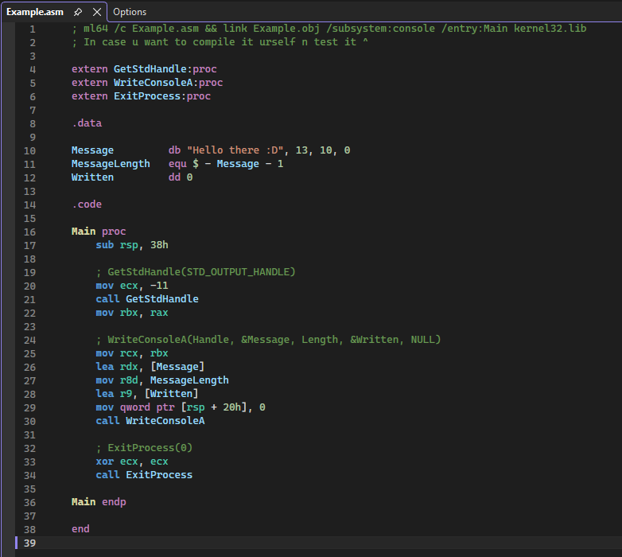
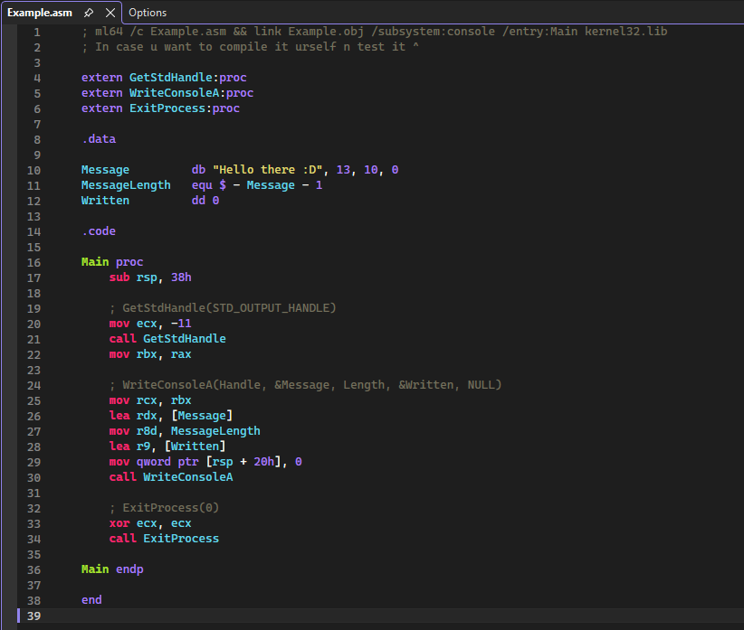
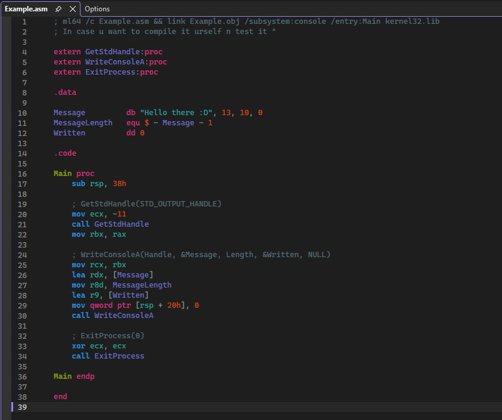

# BetterAsmHighlighter (Better Assembly Highlighter)

I was bored and wanted to make something useful for myself. I think others are gonna like this too (I hope).

A Visual Studio extension that adds proper syntax highlighting for x86/x64 assembly files (`.asm`, `.inc`, `.masm`).

## Screenshots

<table>
<tr>
<td><b>Dark</b></td>
<td><b>Monokai</b></td>
<td><b>Solarized Dark</b></td>
</tr>
<tr>
<td></td>
<td></td>
<td></td>
</tr>
</table>

## Features

3 theme presets, customizable colors, supports `.asm`, `.inc`, `.masm`.

## Customization

**Tools > Options > BetterAsmHighlighter > Theme** to switch presets or tweak individual colors.

You can also change colors through **Tools > Options > Environment > Fonts and Colors** — look for entries starting with "ASM - ".

## Building

You need the **Visual Studio extension development** workload installed to build from source.

Open `BetterAsmHighlighter.sln` in Visual Studio and build. The `.vsix` will be in `Source/bin/Debug/` or `Source/bin/Release/`.

## Roadmap

No idea yet, I'll add stuff as I go.

## Contributing

If you want to add new features that could be useful, just open a PR and go ahead. All contributions are welcome.

## Requirements

Visual Studio 2022 or later.
